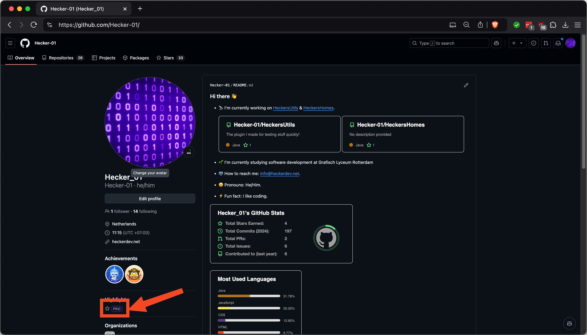

# GitHub Copilot

## GitHub student

Allereerst heb je GitHub student nodig, anders moet je voor copilot betalen

### Checken of je GitHub Student hebt

Ga naar https://github.com/`jouw-username` en check of je een "Pro" badge ziet.

<figure><figcaption></figcaption></figure>

Als je deze badge bij je profile ziet, betekent het dat je GitHub Student hebt, en gratis van copilot gebruik kan maken.
