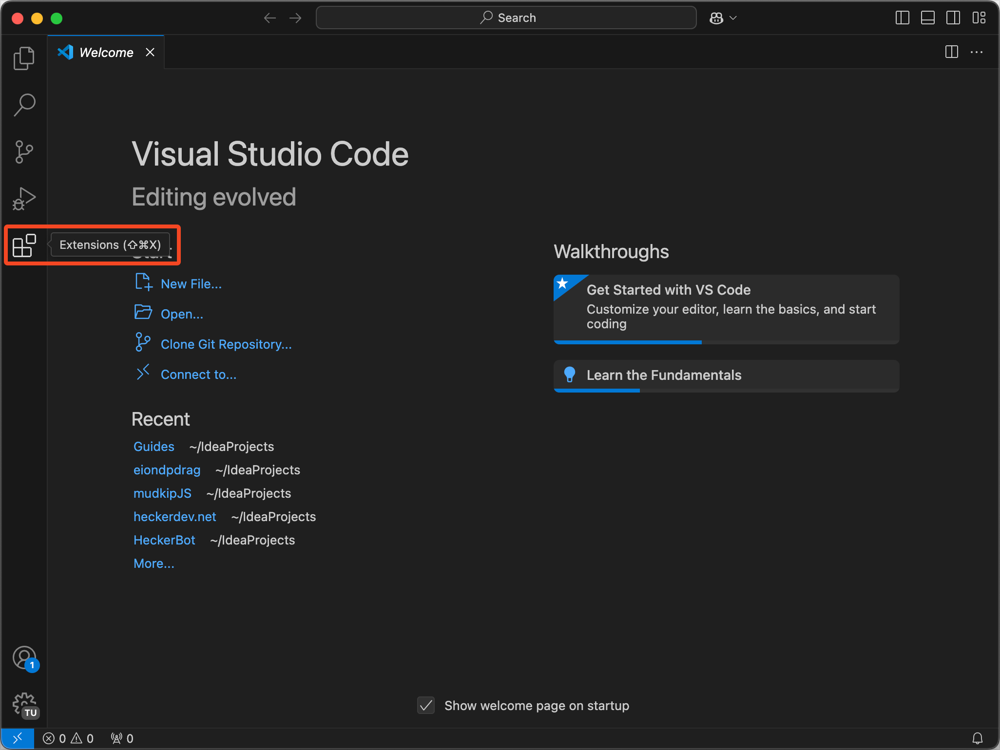
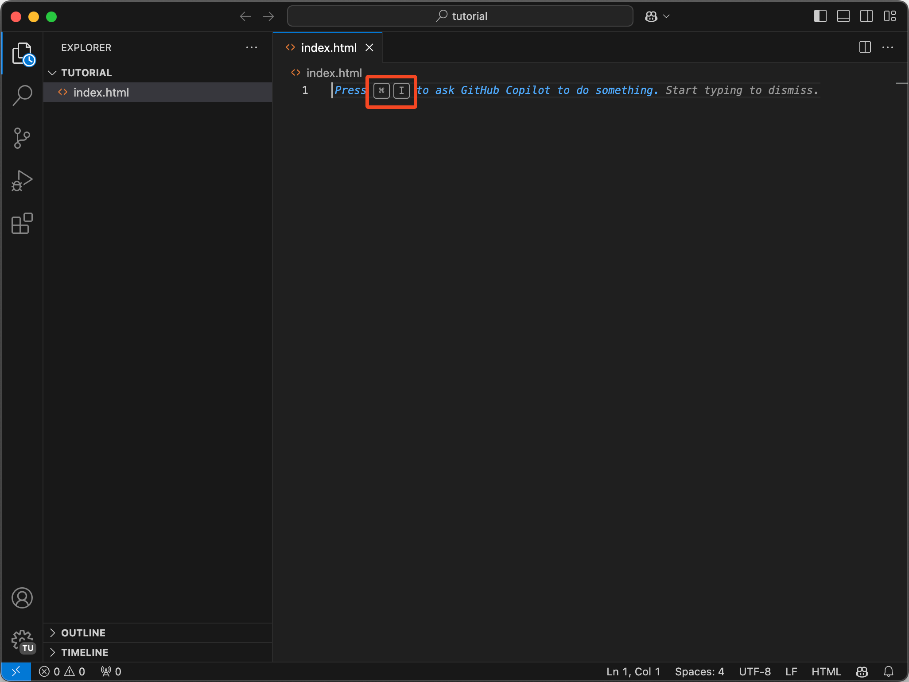
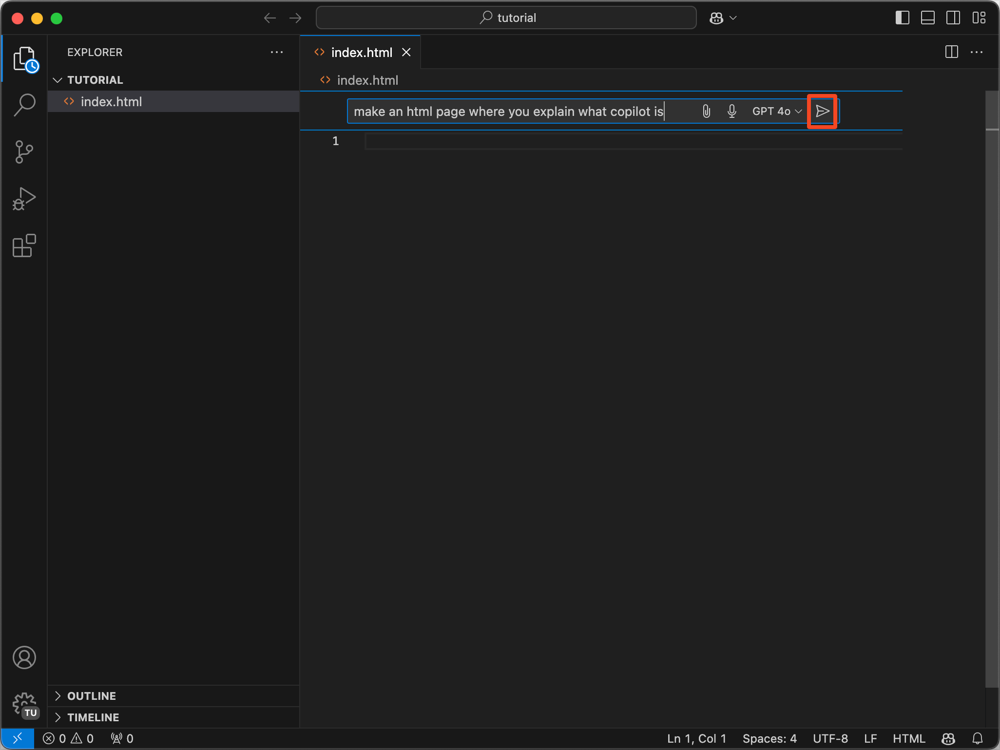
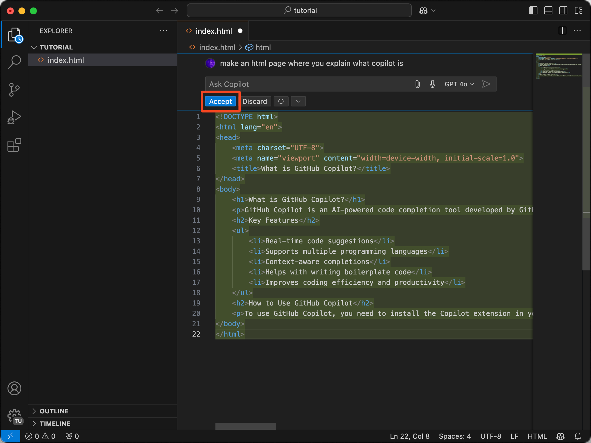
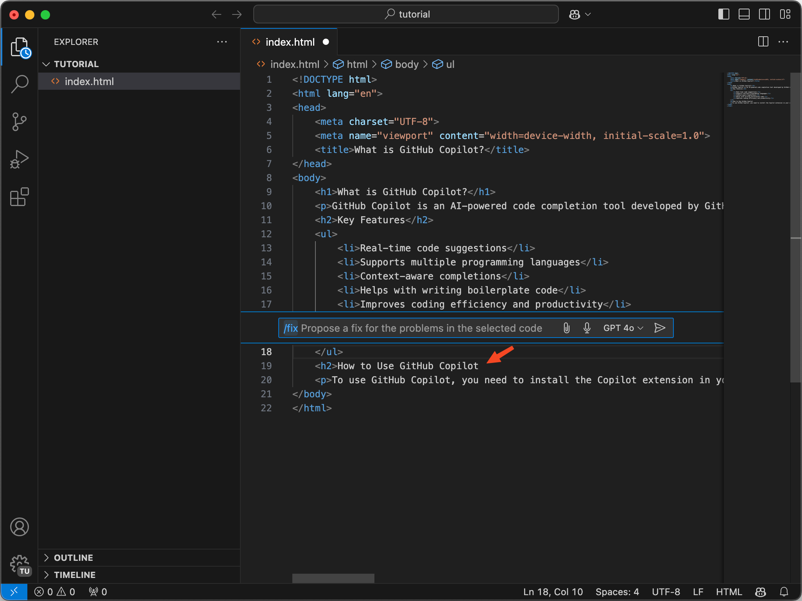
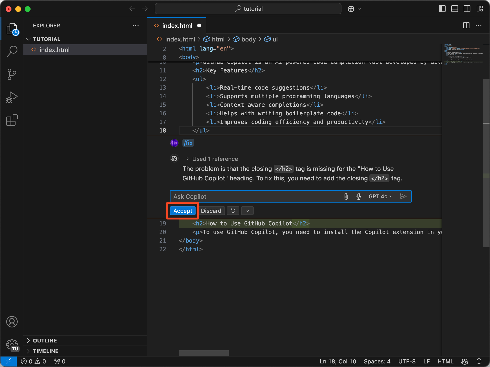

# GitHub Copilot

## GitHub student

Allereerst heb je GitHub student nodig, anders moet je voor copilot betalen.&#x20;

### Checken of je GitHub Student hebt

Ga naar https://github.com/`jouw-username` en check of je een "Pro" badge ziet.

<figure><figcaption></figcaption></figure>

Als je deze badge bij je profile ziet, betekent het dat je GitHub Student hebt, en gratis van copilot gebruik kan maken.\
Heb je dit niet? Ga naar: [GitHub student aanvragen](github-student.md)

## GitHub Copilot installeren

### Stap 0

Voordat we kunnen beginnen met het gebruiken van Copilot moet je eerst naar [https://education.github.com/pack/redeem/copilot-student](https://education.github.com/pack/redeem/copilot-student) om je gratis Copilot te activeren. (Er van uit gaande dat je GitHub Student hebt)

### Stap 1

Copilot installeren

Open Visual Studio Code, en ga naar Extensions

<figure><figcaption></figcaption></figure>

Je krijgt dan een notificatie of je wilt inloggen. Doe dat, anders werkt het niet.

### Stap 2

Copilot gebruiken

Copilot is nu actief, je hoeft verder niets te doen om het te gebruiken, Copilot zal zelf al dingen voorstellen.\
Bijvoorbeeld: dit bericht dat je vanaf nu elke keer krijgt als je een leeg bestand opent


#### Let op!

Copilot kan wel Nederlands, maar ik adviseer om altijd engels te gebruiken omdat copilot getraind is op (99%) engelse tekst en code. hij kan hierdoor bijvoorbeeld \\
naar \ gaan vertalen, en dat gaat niet werken.


<figure><figcaption></figcaption></figure>

Je kan altijd **`⌘+I`** (of **`CTRL+I`** op windows) doen om een Copilot "Prompt" te openen hierin typ je wat je wilt dat copilot doet, en dan zal je zien dat Copilot dat gaat proberen te doen. Ook zal hij uitleg geven wat hij gedaan heeft en waarom.

<figure><figcaption></figcaption></figure>

Hier vraag ik Copilot om een html pagina te maken.

<figure><figcaption></figcaption></figure>

Copilot suggereert dan wat, en als je dat goed lijkt klik je op "Accept".

<figure><figcaption></figcaption></figure>

Hier heb ik `</h2>` even weggehaalt om het `/fix` commando te laten zien.

<figure><figcaption></figcaption></figure>

Copilot snapt meteen het probleem al, ook al heb ik hier geen aanvullende info gegeven.\
hij fixt het en legt uit wat er fout ging.
