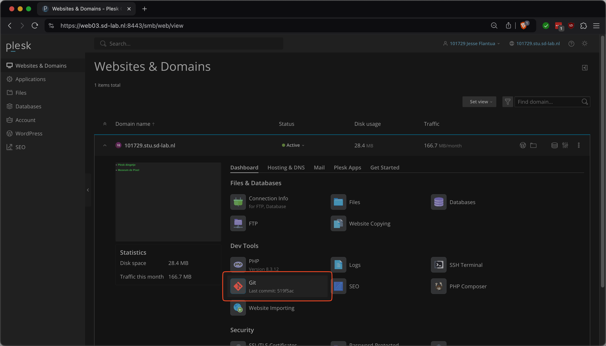
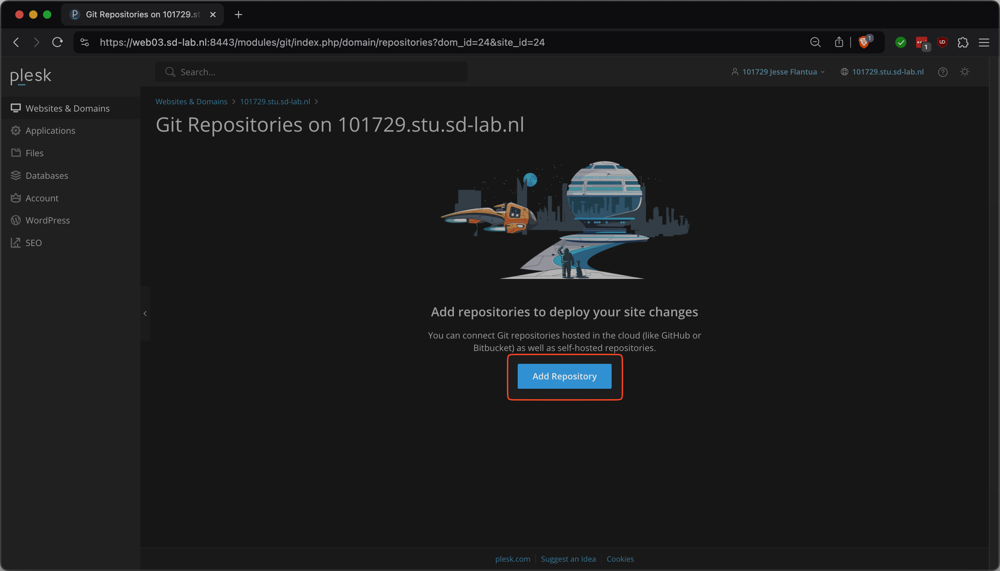
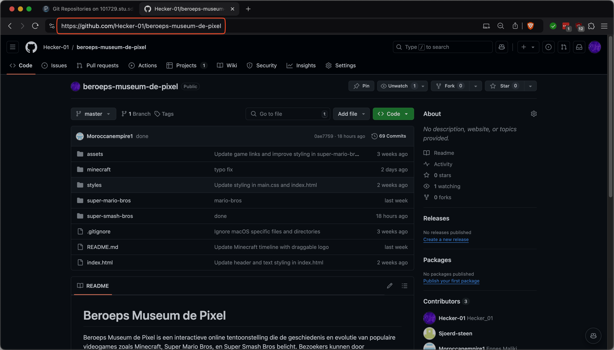
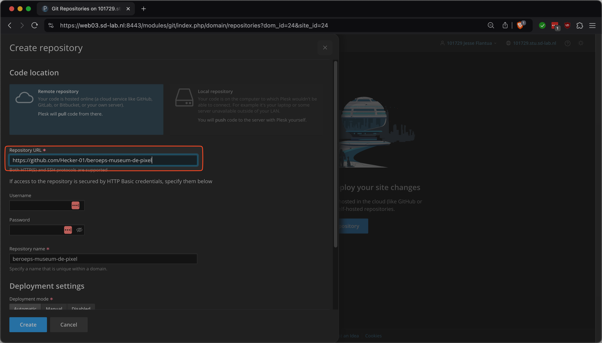
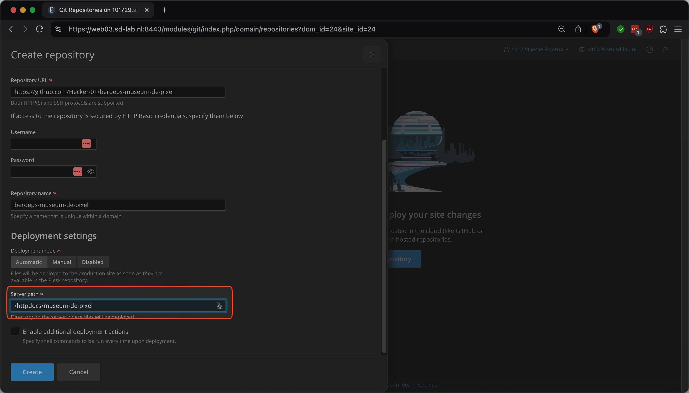
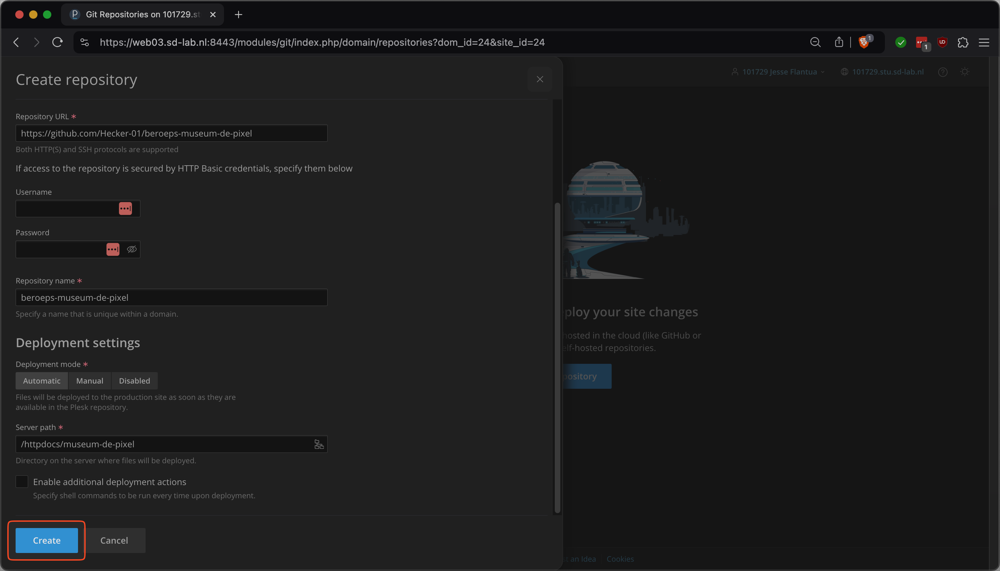
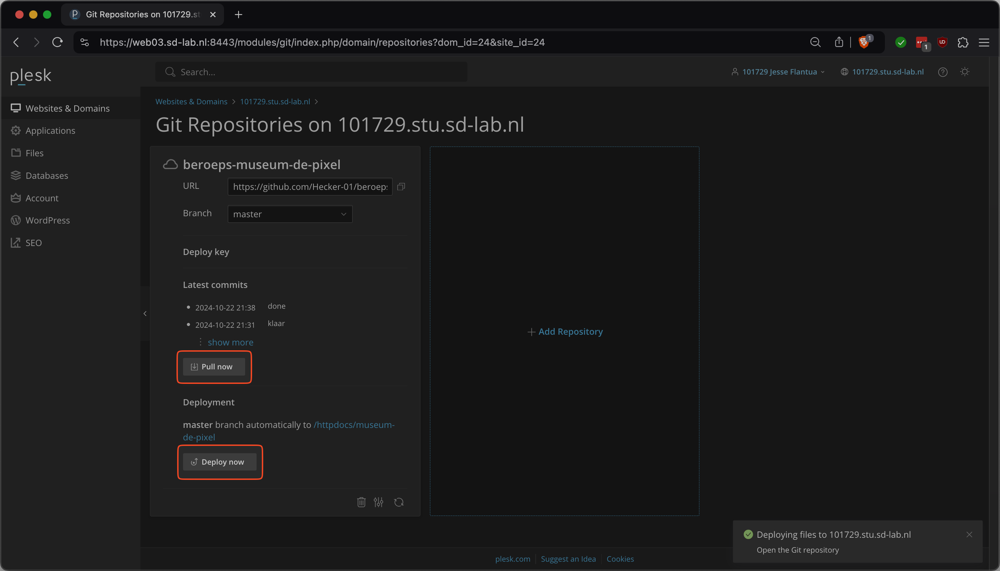

# Hoe kan je je site online zetten?

## Github

Je kan in Plesk een git repo linken aan een folder, dat leg ik hiet uit.

### Stap 1

Zorg ervoor dat je github repo op `public` staat.

#### Ga naar je github repo en bekijk of je repo op public of private staat

<figure><figcaption>
Je repo is Private, ga verder.
</figcaption></figure>

<figure><figcaption>
Je Repo is public, ga naar <a href="publish-site-plesk.md#stap-2">Stap 2</a>
</figcaption></figure>

#### Klik op Settings

<figure><figcaption>
Settings
</figcaption></figure>

#### Verander de visibility

<figure><figcaption>
Change visibility
</figcaption></figure>

### Stap 2

De site online zetten

#### Ga naar [Plesk](https://web03.sd-lab.nl:8443/) & Log in

#### Klik op "Git"

<figure><figcaption>
Klik op Git
</figcaption></figure>

#### Klik "Add Repository"

<figure><figcaption>
Voeg een repository
</figcaption></figure>

#### Kopieer de link van jouw Github repo

<figure><figcaption>
Kopieer deze link
</figcaption></figure>

#### Plak de link hierin

<figure><figcaption>
Plak de link hierin
</figcaption></figure>

#### Verander dit naar `/httpdocs/museum-de-pixel`

<figure><figcaption>
Verander Dit naar /httpdocs/museum-de-pixel
</figcaption></figure>

#### Klik "Create"

<figure><figcaption>
Klik "Create"
</figcaption></figure>

### Stap 3

De site updates (pull & deploy)

#### Na een commit moet je zelf de site updaten, dit doe je door op "Pull now" & daarna op "Deploy now"

<figure><figcaption>
Klik hierop om de site te updaten
</figcaption></figure>

### Stap 4

Je site staat nu online op [https://leerlingnummer.stu.sd-lab.nl/museum-de-pixel](https://leerlingnummer.stu.sd-lab.nl/museum-de-pixel) (vervang leerlingnummer met je leerlingnummer)
