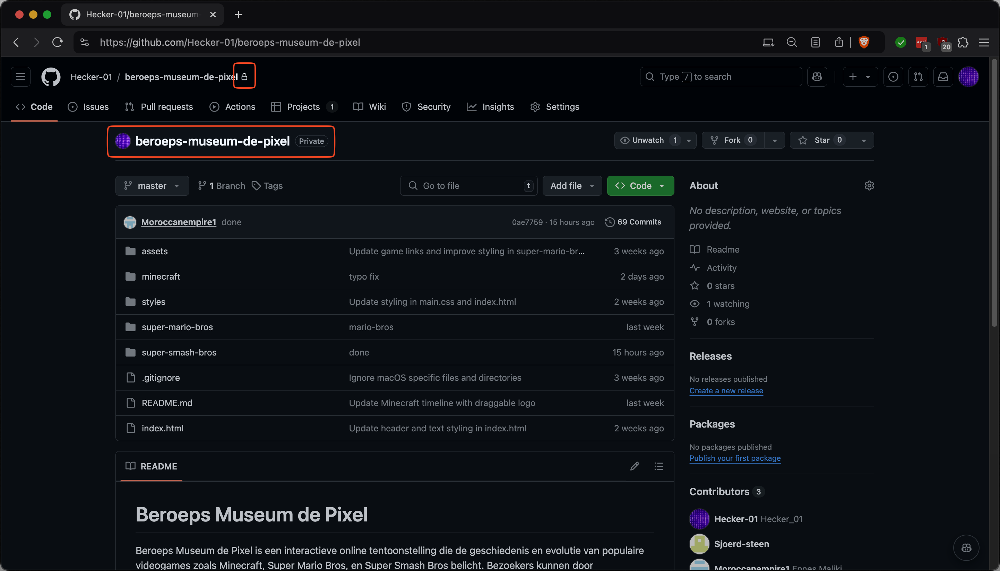
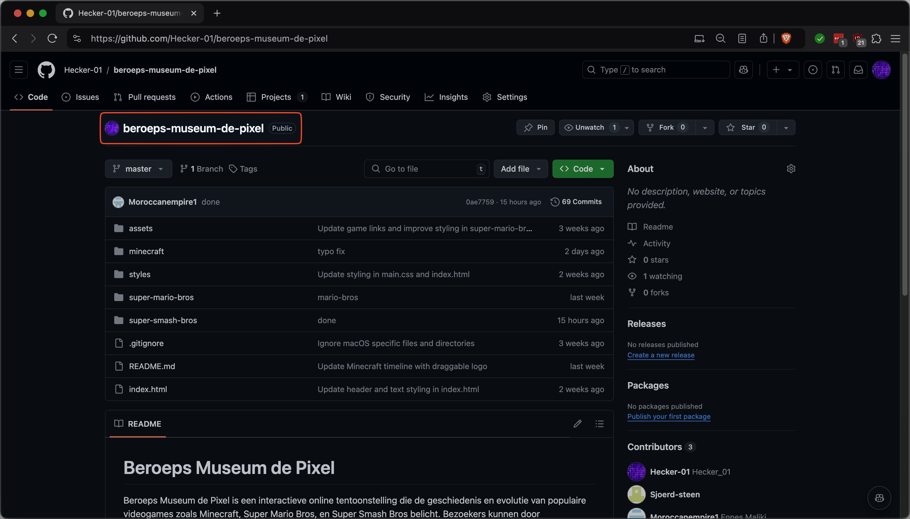
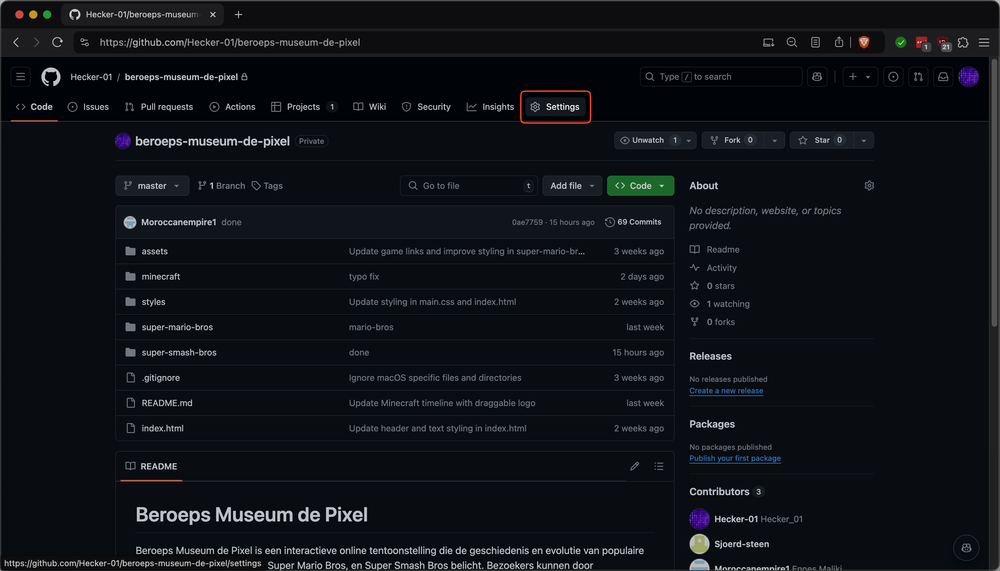
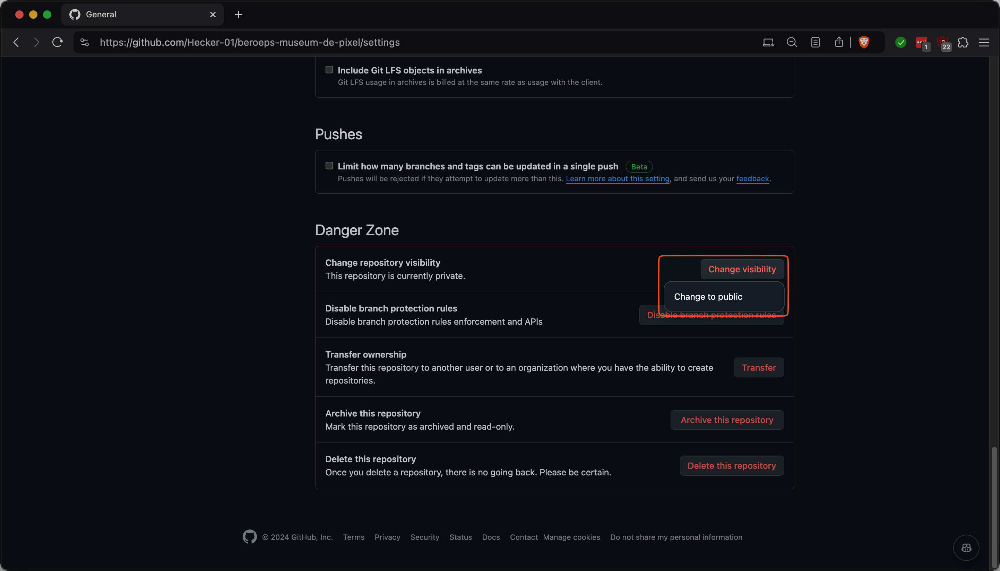

# How can you publish your site?

## Github

In Plesk you can link a git repo to a folder, I will explain how to do that here.

### Step 1

Make sure your github repo is set to `public`.

#### Go to your Github repo and look if it is public or private

<figure><figcaption>
Your repo is Private, continue on.
</figcaption></figure>

<figure><figcaption>
Your Repo is public, go to <a href="#step-2">Step 2</a>
</figcaption></figure>

#### Klik on Settings

<figure><figcaption>
Settings
</figcaption></figure>

#### Change the visibility

<figure><figcaption>
Change visibility
</figcaption></figure>
